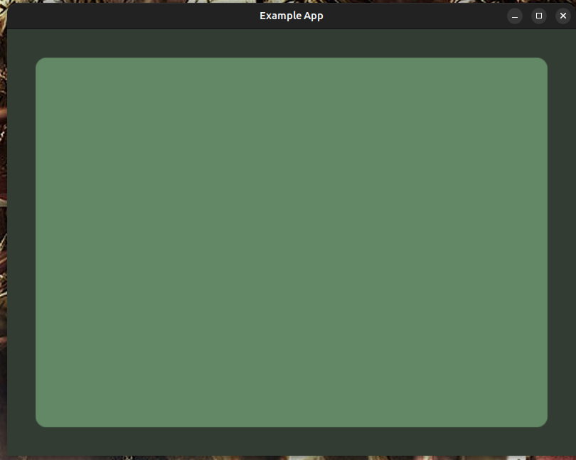
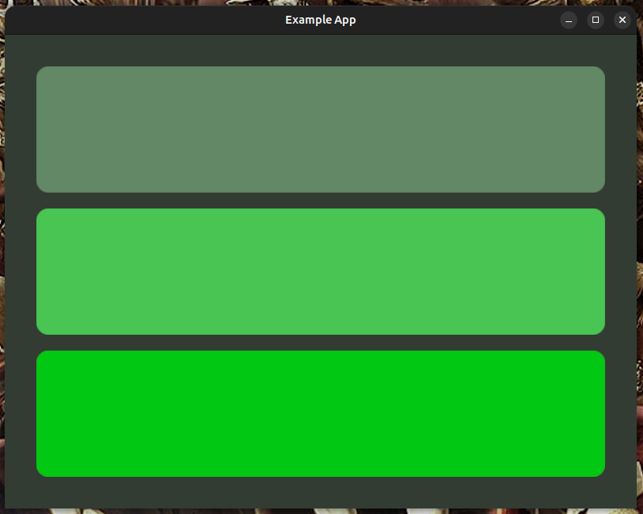

# Design Reference 
## Node

Arbor UI consists of *nodes* in code *arb_node*. 

```c
typedef struct arb_node {
    const arb_type* type;
    const uint32_t  flags;

    union {
        void*   data;
        size_t  data_offset;
    };
} arb_node;
```

Each node consists of *type* which determines how does node behave, *flags* allowing altering this behavior, and *data* which parametrise *type*.
With their childrens, node forms *UI tree*. Flags are bitfield, so multiple can be combined with ```|``` bit-or operator.

## Tree Definition

### Single childed nodes:

A arbor widget can be definied as flat nodes array:
<table>
  <tr>
    <th>Code</th>
    <th>Result</th>
  </tr>
  <tr>
    <td valign="top">
<pre><code class="language-c">arb_node main_structure[] = {
    ARB_NODE(arb_box_type, arb_flag_ignore_max_width | arb_flag_ignore_max_height &(arb_box_data){
        .tint = ARB_HEX("#2f3d30")
    }),
    ARB_PADD(40),
    ARB_NODE(arb_box_type, arb_flag_ignore_max_width | arb_flag_ignore_max_height &(arb_box_data){
        .tint = ARB_HEX("#2c4b2e"),
        .rounding = 16
    }),
    ARB_LAST
};</code></pre>
    </td>
    <td valign="top">
      
    </td>
  </tr>
</table>

Single-child nodes interpret next element of array as own nested child.
``ARB_LAST`` defines end of chain, preventing reading out-of-bounds.

### Array childed nodes:

Array childed nodes, like rows, columns, overlays, except a array of nodes of ``arb_indirect_type`` type. This type of node sends interpreter to another array of nodes - those will be nested as a single container child. To avoid declaring a lot of separate arrays, ARB_ELEM macro can be used - it definies indirect node to local inline nodes array.
(Formatting is bad in example due to limitations of github markdown).
Example:

<table>
  <tr>
    <th>Code</th>
    <th>Result</th>
  </tr>
  <tr>
    <td valign="top">
<pre><code class="language-c">arb_node separate_array[] = {
    ARB_NODE(arb_box_type, arb_flag_ignore_max_width | arb_flag_ignore_max_height, &(arb_box_data){
        .tint = ARB_HEX("#49c554"), .rounding = 16
    }), ARB_LAST
};

arb_node main_structure[] = {
    ARB_NODE(arb_box_type, arb_flag_ignore_max_width | arb_flag_ignore_max_height, &(arb_box_data){
        .tint = ARB_HEX("#323c32")
    }),
    ARB_PADD(40),
    ARB_NODE(arb_column_type, arb_flag_none, &(arb_column_data){
        .horizontal_align = 0.5, .spacing = (arb_length){0, 20, 1}}
    ),
    ARB_ELEM(
        ARB_NODE(arb_box_type, arb_flag_ignore_max_width | arb_flag_ignore_max_height, &(arb_box_data){
            .tint = ARB_HEX("#628865"), .rounding = 16
        }), ARB_LAST
    ),
    ARB_IDIR(separate_array),
    ARB_ELEM(
        ARB_NODE(arb_box_type, arb_flag_ignore_max_width | arb_flag_ignore_max_height, &(arb_box_data){
            .tint = ARB_HEX("#01c812"), .rounding = 16
        }), ARB_LAST
    ),
    ARB_LAST
}; </code></pre>
    </td>
    <td valign="top">
      
    </td>
  </tr>
</table>

In example above, column is wrapped by background box and uniform 40px padding. The column contains, two boxes, inlined with ARB_ELEM and one, in separate array pointed by ARB_IDIR indirect node.

## Sizeing

By default node wraps on it's children. That is following widget:

```c
arb_node widget[] = {
    ARB_NODE(arb_box_type, arb_flag_none, &(arb_box_data){
        .tint = ARB_HEX("#ffffff")
    }),
    ARB_LAST
};
```

Would render with 0-size as box will wrap on nothing. 
This behavior can be altered with following flags:

```
arb_flag_ignore_min_width   // Min width  of this node is set to 0
arb_flag_ignore_min_height  // Min height of this node is set to 0
arb_flag_ignore_max_width   // Max width  of this node is set to inf
arb_flag_ignore_max_height  // Max height of this node is set to inf
```

Therefore following widget would render spanning entire screen:
```c
arb_node widget[] = {
    ARB_NODE(arb_box_type, arb_flag_ignore_max_width | arb_flag_ignore_max_height, &(arb_box_data){
        .tint = ARB_HEX("#ffffff")
    }),
    ARB_LAST
};
```

Flags are applied at respective *measure* passes.
Ingore min flags are usefull when used with clipboxes (otherwise clipbox would wrap on children, and not clip anything).

## Shortcuts

Nodes can be definied as an C struct:
```c
(arb_node){
    .type  = some type,
    .data  = some data,
    .flags = some flags
}
```
Writing long ui like that would be tedious, therefore shortcut macros are definied:

```c
// Shortcut node creation: type, flags, data, child
#define ARB_NODE(argtype, argflags, ...) (arb_node){ \
    .type  = (&argtype),    \
    .flags = (argflags),    \
    .data  = (__VA_ARGS__)  \
}

// Uniform padding (0, max_value, flex 1) node
#define ARB_PADD(max_value)  (arb_node){   \
    .type  = &arb_padding_type,                     \
    .data  = &(arb_padding_data){                   \
        .top    = (arb_length){0, max_value, 1},    \
        .bottom = (arb_length){0, max_value, 1},    \
        .left   = (arb_length){0, max_value, 1},    \
        .right  = (arb_length){0, max_value, 1},    \
    },                                              \
}

// Inline array with single node termianted with ARB_LAST
#define ARB_SINGLE(argtype, argflags, ...) (arb_node[]){    \
    ARB_NODE(argtype, argflags, __VA_ARGS__),               \
    ARB_LAST                                                \
}

// Indirect node shortcut
#define ARB_IDIR(argchild) (arb_node){  \
    .type   = &arb_indirect_type,       \
    .data   = (void*)(argchild)         \
}

// Instance node shortcut, child, data
#define ARB_INST(...) (arb_node){       \
    .type   = &arb_instance_type,       \
    .data   = (__VA_ARGS__)             \
}

// Local indirect to inlined array
#define ARB_ELEM(...) (arb_node){   \
    .type   = &arb_indirect_type,   \
    .data   = (arb_node[]){         \
        __VA_ARGS__                 \
    }                               \
}

// Sentinel value to mark array end
#define ARB_LAST (arb_node){.type = NULL, .data = NULL}
```

## Type

To learn on creating own types, see [Internal Reference](documentation/internal_reference.md). Here we will look at predefinied node types.

### Instance Type

``arb_instance_type`` sets instance for it's subtree. Single childed. Data is pointer to arbitrary instance structure.
See instancing to learn more.

### Invalidation Type

``arb_invalidation_type`` blocks regeneration of subtree' layout. Single childed. Invalidation type data shall be of type:

```c
typedef struct arb_invalidation_data {
    arb_invalidation_flag flag_consumable;
    arb_invalidation_flag flag_always;
} arb_invalidation_data;
```

``flag_always`` tells interpreter which pass shall always occur (width measure, height distribute, etc). Note that enabling width measure, will also cause width distribute, which would call following passes.

``flag_consumable`` is one time regenerate flag - can be used by application to require relayout, when for example, list item was removed or, text changed. Once relayout the flag is set to ``arb_invalidation_flag_none``.

```c
typedef enum arb_invalidation_flag {
    arb_invalidation_flag_text              = 63,
    arb_invalidation_flag_width_measure     = 62,
    arb_invalidation_flag_width_distribute  = 60,
    arb_invalidation_flag_height_measure    = 56,
    arb_invalidation_flag_height_distribute = 48,
    arb_invalidation_flag_position          = 32,
    arb_invalidation_flag_none              = 0,
    arb_invalidation_flag_all               = 63,
} arb_invalidation_flag;
```

### Indirect Type

``arb_indirect_type`` causes interpreter to jump to ``arb_node`` at this node data.
Allows adding container children, linking multiple nodes arrays. With instancing allows adding children to structures
This is a special case of instancing - 

```c
typedef struct instance_data {
    const arb_node* child_to_structure;
} instance_data;

...

ARB_INST(&(instance_data){
    .child_to_structure = some array of nodes
}),
ARB_NODE(arb_indirect_type, arb_flag_instanced_data, offsetof(instance_data, child_to_structure))
```

The interpreter now reads child_to_structure from instance contents as a indirect type child

### Depth Type

``arb_depth_type`` allows altering depth of subtree. Single childed, data type:
```c
typedef struct arb_depth_data {
    short depth_change;
} arb_depth_data;
```
Decreasing depth means going 'into' the screen
Depth alters order of render and cursor detection.

### Box Type

``arb_box_type`` is a box rendering primitive. Single childed, data type:
```c
typedef struct arb_box_data {
    arb_color       tint;       // box color
    const char*     image;      // image name/path, may be NULL
    float           rounding;   // pixel corner rounding radius
    uint32_t        shader;     // shader effect index
} arb_box_data;
```
Meaning of shader is up to renderer implementation.
Image path is also up to renderer.

### Text Type

``arb_text_type`` is a text rendering primitive. Single childed, data type:
```c
typedef struct arb_text_data {
    unsigned int    size;       // font size
    const char*     font;       // font name/path
    const char*     text;       // text pointer
    arb_color       tint;       // text color modyficator
    uint32_t        shader;     // shader effect index
} arb_text_data;
```
Meaning of shader is up to renderer implementation.
Font path is also up to renderer.
Note renderer also handles text layout - therefore utf support is up to implementation.

### Overlay Type

``arb_overlay_type`` - layouts children one on another. The first child is deepest, rendered first, No data, array children.

### Padding Type

``arb_padding_type`` - padds child inside self. Data is arb_padding_data, single childed.
```c
typedef struct arb_padding_data {
    arb_length left, right, top, bottom;
} arb_padding_data;
```

### Row Type

``arb_row_type`` - layouts children in a row, left to right, data is arb_row_data, array children:
```c
typedef struct arb_row_data {
    float           vertical_align;     // 0 - align top,  0.5 - align center, 1.0 - align bottom, other values also work
    arb_length      spacing;            // spacing between children
} arb_row_data;
```

### Column Type

``arb_column_type`` - layouts children in a column, top to down, data is arb_column_data, array children:
```c
typedef struct arb_column_data {
    float           horizontal_align;   // 0 - align left,  0.5 - align center, 1.0 - align right, other values also work
    arb_length      spacing;            // spacing between children
} arb_column_data;
```

### Sizebox Type

``arb_sizebox_type`` - ovewrites selected child measures, single childed, data shall be arb_sizebox_data pointer:
```c
typedef enum arb_sizebox_overwrite_flag {
    arb_sizebox_overwrite_none        = 0,
    arb_sizebox_overwrite_all         = 255,
    arb_sizebox_overwrite_all_width   = 7,
    arb_sizebox_overwrite_all_height  = 56,

    arb_sizebox_overwrite_width_min   = 1 << 0,
    arb_sizebox_overwrite_width_max   = 1 << 1,
    arb_sizebox_overwrite_width_flex  = 1 << 2,

    arb_sizebox_overwrite_height_min  = 1 << 3,
    arb_sizebox_overwrite_height_max  = 1 << 4,
    arb_sizebox_overwrite_height_flex = 1 << 5
} arb_sizebox_overwrite_flag;
typedef struct arb_sizebox_data {
    arb_sizebox_overwrite_flag  flag;
    arb_length                  width;
    arb_length                  height;    
} arb_sizebox_data;
```

